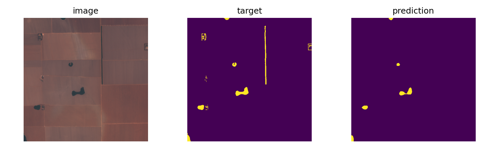

# Computer Vision: Compression and Segmentation

This repository contains notebook-based experiments on Amazon forest imagery. It
trains convolutional autoencoders for image compression, fine-tunes a semantic
segmentation model, and measures how learned compression, JPEG, and WebP affect
segmentation quality.

## Experiments

### Image compression

[`image_compressor.ipynb`](image_compressor.ipynb) includes:

- optional Sentinel-2 scene discovery and patch extraction;
- configurable convolutional autoencoders;
- explicit-latent and quantized compression models;
- training sweeps over bottleneck sizes and rate-loss weights; and
- qualitative comparison of source and reconstructed images.

### Image segmentation

[`image_segmentation.ipynb`](image_segmentation.ipynb) includes:

- fine-tuning a pretrained `torchvision` FCN-ResNet50 model;
- evaluation with IoU, mean accuracy, and Dice metrics;
- comparison of original, autoencoder-compressed, JPEG, and WebP images; and
- export of checkpoints, run metadata, result tables, plots, and examples.



## Repository contents

```text
.
├── image_compressor.ipynb
├── image_segmentation.ipynb
├── image_segmentation/
│   ├── checkpoints/
│   ├── run_metadata.json
│   ├── segmentation_compression_summary.csv
│   └── visual_examples/
├── outputs/
└── autoencoder_for_compression.pdf
```

The CSV and JSON files are generated experiment artifacts. The PDF is a
companion report on the compression experiments.

## Requirements

- Python 3.10 or newer
- JupyterLab or Jupyter Notebook
- PyTorch and torchvision
- Pillow, Matplotlib, and NumPy
- the local `vision_studio` package used by both notebooks
- optional: `diffusers`, `wandb`, `pystac-client`,
  `planetary-computer`, and `stackstac`

A CUDA-capable GPU is recommended for full training runs, although the notebooks
fall back to CPU.

## Running the notebooks

Create an environment and install the notebook dependencies:

```bash
python3 -m venv .venv
source .venv/bin/activate
python3 -m pip install --upgrade pip
python3 -m pip install jupyter torch torchvision numpy pillow matplotlib
python3 -m pip install diffusers wandb pystac-client planetary-computer stackstac
```

Install or expose `vision_studio`, then start Jupyter:

```bash
jupyter lab
```

Open the notebooks in this order:

1. `image_compressor.ipynb` to train and save compression models.
2. `image_segmentation.ipynb` to train the segmentation model and evaluate the
   compression variants.

The notebooks currently default to local dataset and checkpoint directories.
Update their configuration cells or use these environment variables for the
segmentation experiment:

```bash
export SEGMENTATION_DATASET_PATH="/path/to/Amazon Forest Dataset"
export SEGMENTATION_AUTOENCODER_DIR="/path/to/autoencoder/checkpoints"
export SEGMENTATION_RUN_MODE="quick"  # quick or full
```

Use `quick` mode for a small smoke test before launching a full run.

## Existing results

The included full-run summary reports a baseline mean IoU of approximately
`0.841`. Among the recorded traditional codecs, high-quality JPEG retained
nearly all baseline performance with a mean IoU of approximately `0.837`.
Detailed results are available in
[`image_segmentation/segmentation_compression_summary.csv`](image_segmentation/segmentation_compression_summary.csv).
